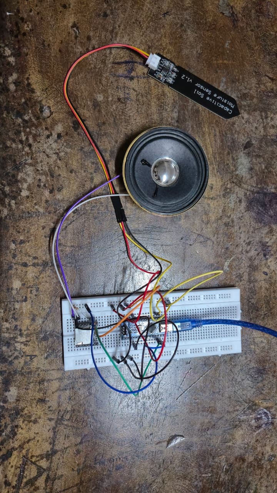

🌱 MoodGrow 🎶
"When plants get moody, we play their tune!" – Because soil moisture deserves a playlist 🎧

📌 Basic Details
👨‍💻 Team Members

🏆 Team Lead: Adarsh A M

🛠 Member 2: Adithya Krishna

📝 Project Description
MoodGrow is a totally unnecessary but hilariously fun project that uses an ESP32 and a soil moisture sensor 🌿 to detect your plant’s mood and plays songs on a website 🎵 accordingly. Dry soil? Sad tunes. Well-watered? Chill beats. Overwatered? Oh no, the wet blanket track!

Because plants deserve a soundtrack too.

🤦 The Problem (that nobody asked to solve)
Plants can’t text you when they’re thirsty.

Soil moisture sensors just beep or show numbers — boring!

No music for the plant feels = no real empathy.

💡 The Solution (that nobody expected)
ESP32 measures soil moisture and sends data to Firebase.

A web app listens live and plays different songs depending on soil moisture level.

Brings plant mood swings to your ears with fun audio tracks.

Because watering plants should be a party, not a chore.

🛠 Technical Details
💻 Software
Microcontroller: ESP12

Languages: C++ (Arduino IDE), HTML, JavaScript

Cloud: Firebase Realtime Database

Frontend: Simple web app with Firebase SDK

📱 Hardware
ESP32 Dev Board

Soil moisture sensor (analog)

USB cable for programming

WiFi hotspot (mobile or router)

⚙️ Implementation
📥 Setup
bash
Copy
Edit
# Clone repo (if available)
git clone <useless>
cd MoodGrow
🚀 Run
Flash ESP32 with provided Arduino code (update WiFi & Firebase config)

Open Serial Monitor (115200 baud) to check sensor and Firebase connection

Open the web app in a modern browser

Watch as your plant’s mood translates into music

📸 Project Documentation
Screenshots

Real-time soil moisture values and Firebase updates

![Web App]
Music player reacts to plant moods with different songs

Diagrams
![System Architecture]
How data flows from soil to songs

🎥 Project Demo
 
See MoodGrow in action — when the soil’s dry, the music changes instantly!

👨‍💻 Team Contributions
Adarsh A M: Project lead, Firebase integration, web app design

Adithya Krishna: ESP32 coding, sensor calibration, serial debugging

Made with ❤️, soil vibes 🌱, and random tunes 🎶 at TinkerHub Useless Projects

